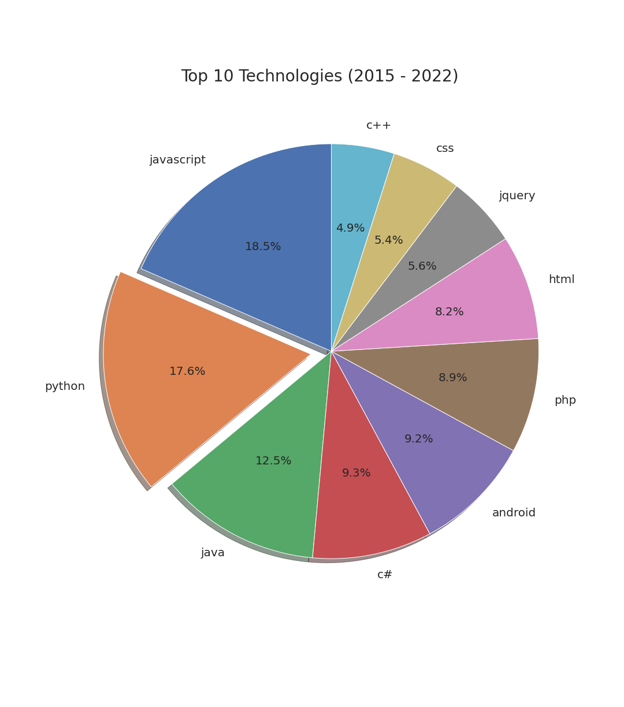

# Introduction 
The following repo contains an exploratory analysis on the [StackOverflow public dataset](https://cloud.google.com/blog/topics/public-datasets/google-bigquery-public-datasets-now-include-stack-overflow-q-a) using BigQuery. Specifically, we notice a continuous decline in posts (questions & answers) on the site, starting from 2014. 

We discuss possible root causes for this phenomenon, whether StackOverflow should be worried, and possible solutions to expedite growth. 

# Root Cause Analysis
One possible explanation is that the easier questions (e.g. "how to make a plot in Python", "how to read a csv file in Pandas", "how to use SELECT statement in MySQL", etc.) have already been asked, leaving users with an increasingly small pool of more niche questions. This is evidenced by the observation that the top 10 most asked-about technologies on the site has remained largely unchanged pre-2014 vs post-2014. Notice from the pie charts below, while their distributions might vary, 90% of the top 10 are the same.

  
  

Additionally, users (especially newer ones) may feel increasingly intimidated to post questions, out of fear of being downvoted or criticized by the community. In fact, we see a clear downward trend in posts that receive positive ratings, and a corresponding upward trend in posts that receive negative ratings. 

# Big Picture
At the end of the day, does this decline in number of posts really matter? One way of answering this question is looking at the current user base. Specifically, we notice from the data that new user growth has been on the rise since 2008. However, the number of inactive users has also been increasing over the same time interval. Most worryingly, in 2019, this user base exceeded the number of new users the site was bringing in, and has only gotten worse with time. While it's natural to expect a growing number of new users to lead to more inactive users, the worsening relative gap between the two trends should still be addressed. 

# Next Steps
Based on the data, when looking at the average number of questions per year with respect to account creation year, we find that users who joined early on during the site's launch in 2008, and users who joined very recently, are the ones posting the most questions! Conversely, users who've been on the site for a few years but are somewhat removed from the early birds are the ones asking the least questions. This implies that the early birds may be acting as gatekeepers, with new users initially eager to ask questions, but as time goes on, they become increasingly jaded, and thus less likely to make new posts (some, even abandoning the site altogether).

Hence, we suggest that StackOverflow police toxicity by introducing an automated filter for clear and obvious non-answers (e.g. "why would you even ask that", "this question has already been asked stupid", etc.). Additionally, StackOverflow could provide users with more incentives for asking and answering questions, such as virtual currency that could be exchanged for merch.
